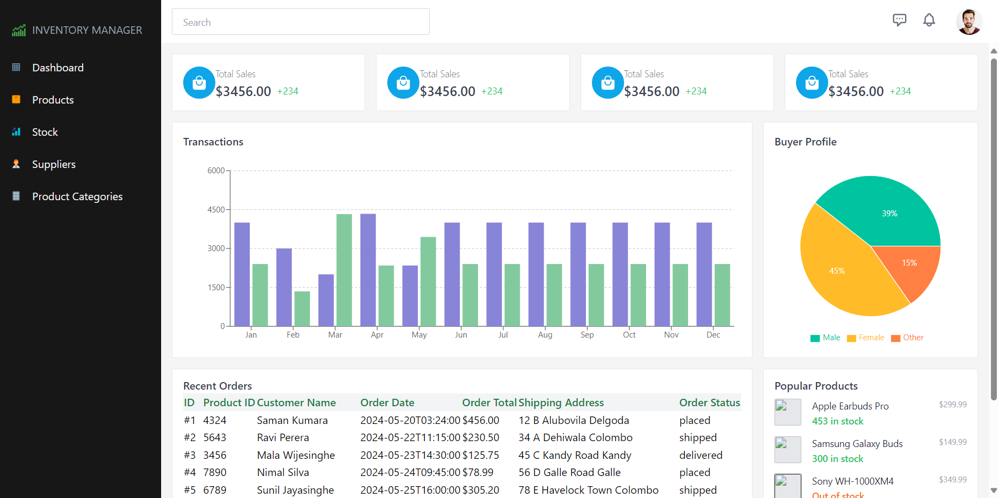

# Advanced Stock and Customer Management System

Welcome to the Advanced Stock and Customer Management System repository! This project is built using the MERN stack (MongoDB, Express.js, React.js, Node.js) and provides comprehensive CRUD services for managing various aspects of stock and customer data.



## Table of Contents
- [Project Overview](#project-overview)
- [Features](#features)
- [Installation](#installation)
- [Usage](#usage)
- [Contributing](#contributing)
- [License](#license)

## Project Overview

This system is designed to streamline the management of inventory, products, suppliers, and more. It includes the following key CRUD services:
- **Dashboard**: Provides an overview of the system's data.
- **Product Management**: Manage product details, including adding, updating, and deleting products.
- **Stock Management**: Track stock levels and manage inventory.
- **Supplier Management**: Maintain a list of suppliers and their products.
- **Product Category Management**: Organize products into categories for easier management.

### Inventory Manager Role

As the Inventory Manager, my role is focused on the **Stock Management** module. This involves:
- Keeping track of stock levels.
- Ensuring that inventory data is accurate and up-to-date.
- Managing stock inflow and outflow.
- Generating reports on stock status.

## Features

- **Real-time Data**: Utilize MongoDB for real-time data storage and retrieval.
- **User-friendly Interface**: Built with React.js for a responsive and intuitive user interface.
- **Efficient Backend**: Powered by Node.js and Express.js for a robust backend service.
- **Comprehensive Management**: Covers all aspects of stock and customer management.

## Installation

Follow these steps to set up the project on your local machine:

### Prerequisites

Make sure you have the following installed:
- Node.js (v14.x or higher)
- MongoDB (v4.x or higher)

### Steps

1. **Clone the Repository**

    ```sh
    https://github.com/chathuwa-whiz/inventory-manager.git
    cd your-repo-name
    ```

2. **Install Server Dependencies**

    ```sh
    cd server
    npm install
    ```

3. **Install Client Dependencies**

    ```sh
    cd ../client
    npm install
    ```

4. **Configure Environment Variables**

    Create a `.env` file in the `server` directory and add the following:

    ```env
    MONGO_URI=your-mongodb-uri
    PORT=5000
    ```

5. **Run the Development Server**

    Open two terminals:

    - In the first terminal, start the server:

        ```sh
        cd server
        npm run dev
        ```

    - In the second terminal, start the client:

        ```sh
        cd client
        npm start
        ```

6. **Access the Application**

    Open your browser and navigate to `http://localhost:3000`.

## Usage

Once the application is up and running, you can explore the various features through the intuitive interface. As the Inventory Manager, you will primarily interact with the Stock Management module to maintain and update stock information.

## Contributing

We welcome contributions from the community. To contribute:

1. Fork the repository.
2. Create a new branch (`git checkout -b feature-branch`).
3. Commit your changes (`git commit -m 'Add some feature'`).
4. Push to the branch (`git push origin feature-branch`).
5. Open a pull request.

Please ensure your code adheres to our coding standards and includes appropriate tests.

## License

This project is licensed under the MIT License. See the [LICENSE](LICENSE) file for details.